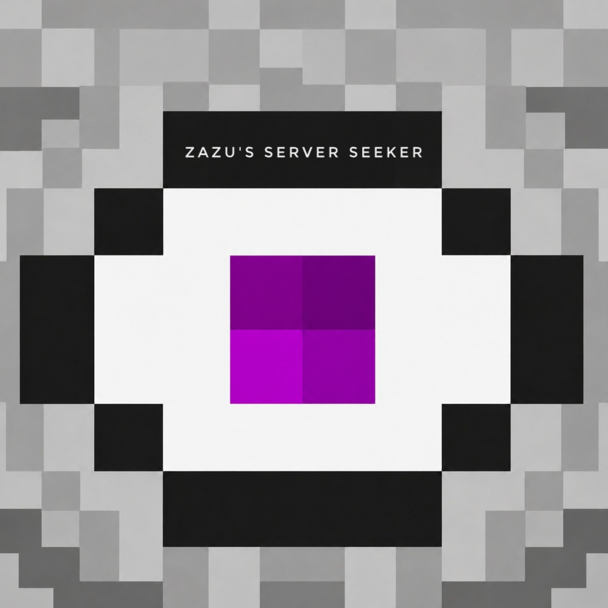

# Zazu's Server Seeker



**Zazu's Server Seeker** is a client-side Fabric mod for **Minecraft Java Edition 26.2** that makes discovering, organising and testing multiplayer servers easier from inside Minecraft.

The mod adds a multi-source server Finder, separates saved servers into useful categories, provides favourites and management controls, and includes sequential Auto Join for newly scanned servers. It is a standalone Fabric mod and does **not** require Meteor Client.
  
## Support and bug reports

Join the [Zazu's EyeBot Network Discord](https://discord.gg/TC4PhPx9sf) for support, beta testing and bug reports. Use the dedicated **Zazu's Server Seeker** channels so reports and suggestions are easy to follow.

You can also submit bug reports and new features suggests here 
(https://github.com/Zazuzin/Zazus-Server-Scanner/issues)

You can also find Zazuzin in the [BreakBlocks Discord](https://breakblocks.com/discord).

## Credits

Special thanks to [BreakBlocks](https://breakblocks.com), whose server-discovery service is the backbone of Zazu's Server Seeker.

Join the [BreakBlocks Discord](https://breakblocks.com/discord) to learn more and connect with its community.

## What the mod does

Opening Minecraft's **Multiplayer** screen gives you a category hub with:

- **Favourites** — servers you have marked as favourites.
- **Servers** — manually added/existing servers and scanned servers that have been verified by a stable successful join.
- **Scanned Servers** — servers added through the Finder that have not yet been verified.
- **Recent Servers** — the last 5 unique saved servers that reached a stable successful join, newest first.
- **Zazu's Server Seeker / Finder** — discovers servers from supported public server databases, verifies them directly with the Minecraft status protocol, and lets you inspect or add them.

The categories are views over Minecraft's normal `servers.dat`; the mod stores classification metadata separately rather than creating duplicate server databases.

## Key features

- **Multi-provider server discovery** with BreakBlocks, Cornbread and MineScan.
- **Auto source mode** that prefers BreakBlocks and falls back to another provider if it is unavailable, rate-limited or exhausted.
- **All Sources mode** that rotates between available providers and merges results.
- **Direct source selection** for BreakBlocks, Cornbread or MineScan.
- **Cross-provider de-duplication** by normalized `IP:port`.
- **Two-pass direct Minecraft status verification** before Finder results are displayed or Auto Added.
- **Optional BreakBlocks API key support**; Cornbread and MineScan do not require a key.
- **Configurable BreakBlocks recency window**: 1, 7, 14, 21 or 30 days (default 7).
- **Verified and Quick search modes**: Verified requires two live Minecraft status replies; Quick shows provider records immediately and disables Auto-add.
- **Version**, **minimum/maximum player**, and **Any / Premium / Cracked** filtering.
- **Sorting options** for Finder results.
- **Add Server** and **View Details** controls, including the discovery source.
- **Continuous Auto Add** until stopped or the configured limit is reached.
- **Added-history tracking** so previously added servers can be skipped.
- **Favourites** with a dedicated category and an in-game pause-menu Favourite/Unfavourite control.
- **Recent Servers** history for the last 5 successful stable joins.
- **Per-server Delete** controls and **Delete All Servers** for the established Servers category.
- **Whitelist cleanup** — definite whitelist rejections are automatically removed.
- **Sequential Auto Join** in Servers and Scanned Servers, always excluding Favourites.
- Ordinary Auto Join connection failures continue to the next eligible scanned server.
- A scanned server that stays connected for roughly eight seconds is automatically promoted to **Servers**.
- **ViaFabricPlus integration** when ViaFabricPlus is installed.
- **Finder latency display**, diagnostics, settings and statistics.

## Finder sources

The Finder source is selected from **Settings → Finder Source**.

- **Auto** — default. Tries BreakBlocks first; if that provider is unavailable, rate-limited, or its result window is exhausted, the same search continues with Cornbread and then MineScan.
- **All Sources** — rotates between all available providers, merges results, and removes duplicate endpoints.
- **BreakBlocks** — use only BreakBlocks.
- **Cornbread** — use only Cornbread's public random-server API.
- **MineScan** — use only MineScan's public random-server API.

For BreakBlocks, **Settings → BreakBlocks Age** controls how recently a server must have been pinged by BreakBlocks. Available values are **1, 7, 14, 21 and 30 days**, with **7 days** as the default for new installations.

Provider data is treated as discovery input rather than proof that a server is currently usable. Zazu's Server Seeker requires two successful bounded pure-Java Minecraft status requests, roughly one second apart, before showing or Auto Adding a candidate. Known provider-reported whitelisted servers are skipped before that verification.

External providers have their own availability and rate limits. A provider outage therefore does not necessarily make the Finder unavailable when **Auto** or **All Sources** is selected.

## Scanner settings

Open **Finder → Settings** to change the scanner's default behaviour:

- **Auto-add Default** — starts Verified searches with Auto-add enabled. Quick Search always disables Auto-add because its results have not been checked directly.
- **Auto-add Limit** — sets how many verified servers may be added during one continuous Auto-add run, or allows an unlimited run.
- **Finder Source** — selects Auto, All Sources, BreakBlocks, Cornbread or MineScan. Auto begins with BreakBlocks and can continue with another provider when necessary.
- **BreakBlocks Age** — limits BreakBlocks results to servers seen within the selected 1, 7, 14, 21 or 30-day window. A shorter window favours newer records; a longer window provides a larger pool.
- **Search Mode** — Verified performs two direct Minecraft status checks before displaying a server; Quick displays provider results immediately as unverified and requires manual review.
- **BreakBlocks API Key** — shows whether an optional key is configured. The key itself is stored in `config/zazus-server-tool.properties`, not entered on the settings screen.

The Finder's main screen also provides version, player-count and Premium/Cracked filters plus result sorting. **Reset Search** clears the current result set without deleting saved servers.

## Requirements

- **Minecraft Java Edition 26.2**
- **Fabric Loader 0.19.3** or a newer compatible release
- **Fabric API** — tested target: `0.157.0+26.2`
- A Java runtime suitable for Minecraft 26.2
- **ViaFabricPlus 4.6.1+** is optional

## Installation

1. Install **Fabric Loader** for Minecraft 26.2.
2. Install the matching **Fabric API**.
3. Download the release JAR, or build it from this repository.
4. Put the JAR in the Minecraft instance's `mods` folder.
5. Remove any older Zazu's Server Seeker JAR so only one version is installed.
6. Start Minecraft using the Fabric profile / Fabric-enabled launcher instance.
7. Open **Multiplayer** to access the category hub and Finder.

Example:

```text
mods/
├── fabric-api-0.157.0+26.2.jar
├── Zazus-Server-Seeker-0.4.0-beta.1+mc26.2.jar
└── ViaFabricPlus-4.6.1.jar        # optional
```

## BreakBlocks API key (optional)

A BreakBlocks API key is **not required**, and it is used only by the BreakBlocks provider. Cornbread and MineScan require no key in this implementation.

To use your own BreakBlocks key, run the mod once and open:

```text
config/zazus-server-tool.properties
```

Set:

```properties
breakBlocksApiKey=YOUR_API_KEY
```

The key is sent only in the HTTP `Authorization: Bearer ...` header. It is not bundled in the mod, placed in request URLs, or written to Zazu's Server Seeker log messages.

If BreakBlocks rejects a configured key with HTTP 401/403, its request is retried anonymously. If BreakBlocks is unavailable or rate-limited while **Auto** or **All Sources** is selected, the Finder can continue with another provider.

**Do not commit or share your API key.**

## Using the categories

### Favourites

Favourited servers appear only in this category. Unfavouriting from Favourites moves the server into the established Servers category.

### Servers

Contains existing/manually added servers and scanned servers that have been verified by a stable join.

### Scanned Servers

Finder-added servers begin here. **Auto Join** is available here and in Servers; Favourites are always excluded:

1. It attempts the first eligible scanned server.
2. An ordinary connection failure moves to the next server.
3. A definite whitelist rejection deletes that server and continues.
4. Pressing the real connection-screen Cancel button stops the run.
5. A stable successful connection stops Auto Join and promotes that server to Servers.

## Building from source

The repository contains the complete readable source and does not require a prebuilt Zazu's Server Seeker JAR.

For the verified dependency-free release build, JDK 21+ is sufficient:

```bash
./build.sh
./verify.sh
```

Output:

```text
build/libs/Zazus-Server-Seeker-0.4.0-beta.1+mc26.2.jar
```

The release classes intentionally target Java 21 bytecode. Minecraft 26.2 itself uses a newer Java runtime.

The repository also includes Fabric Loom/Gradle files for IDE and development use. With a compatible Gradle installation and Java 25:

```bash
gradle build
```

## Project identity

- **Mod:** Zazu's Server Seeker
- **Mod ID:** `zazus-server-tool`
- **Package:** `dev.zazuzin.zst`
- **Author:** Zazuzin
- **Current source version:** 0.4.0-beta.1

## License

Zazu's Server Seeker is licensed under the [GNU General Public License v3.0 only](LICENSE).
